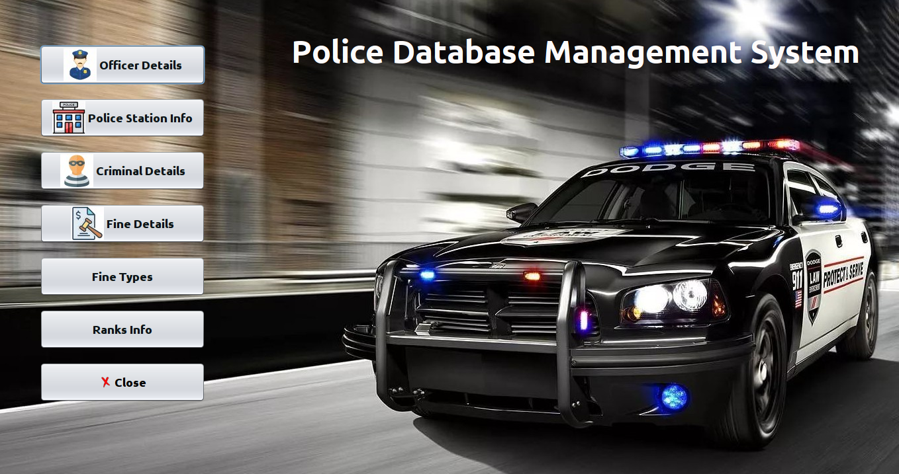
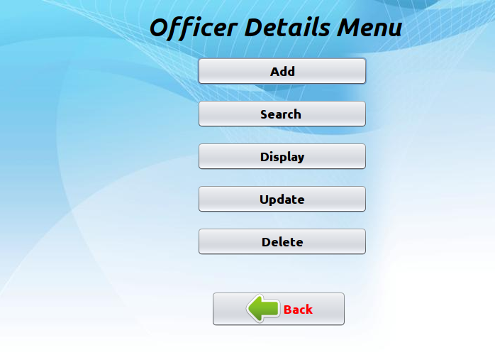
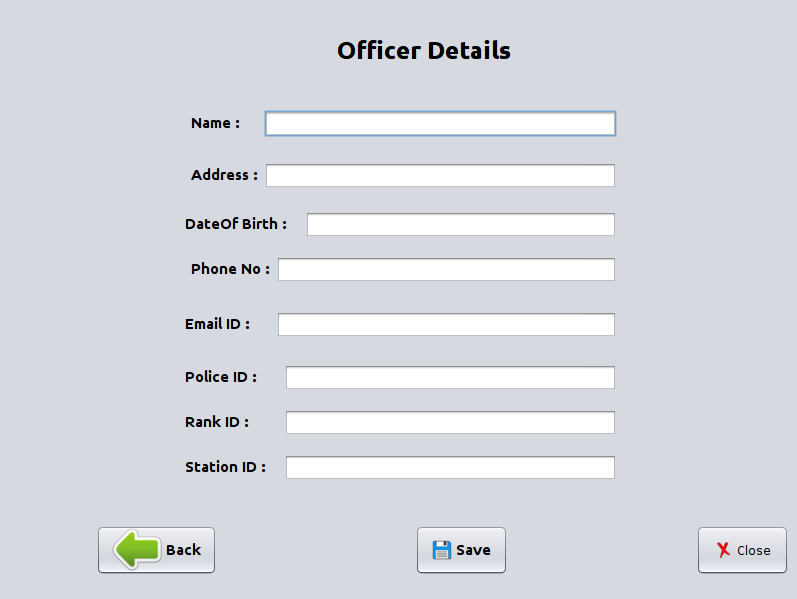
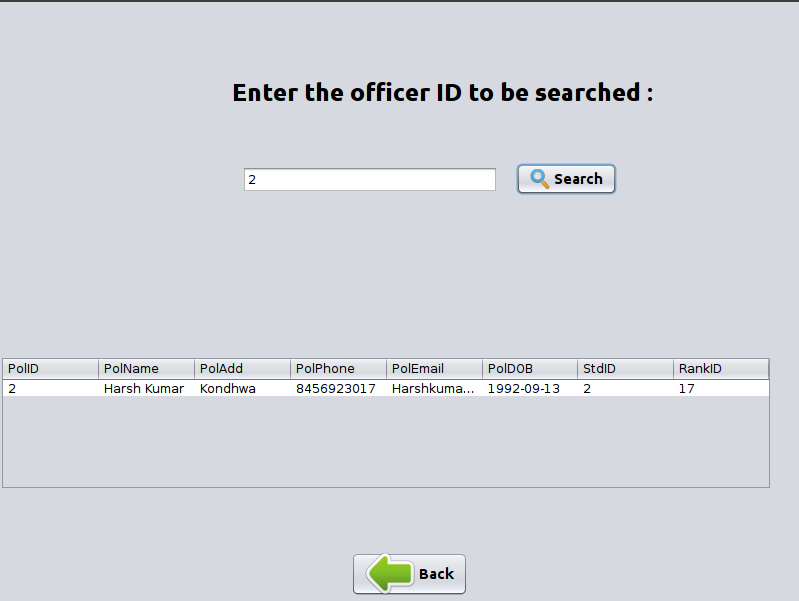
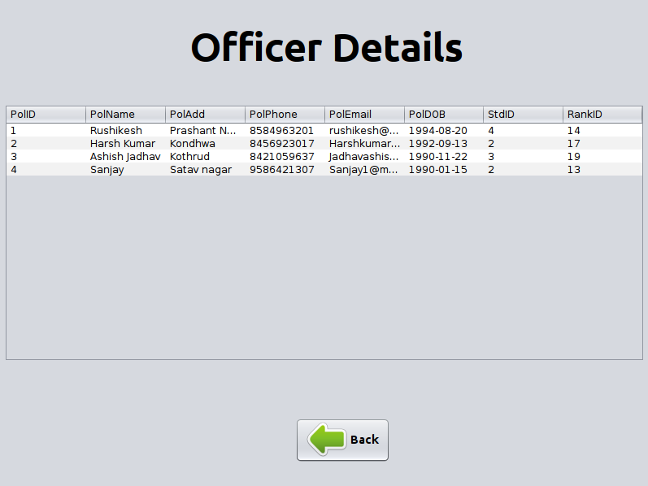
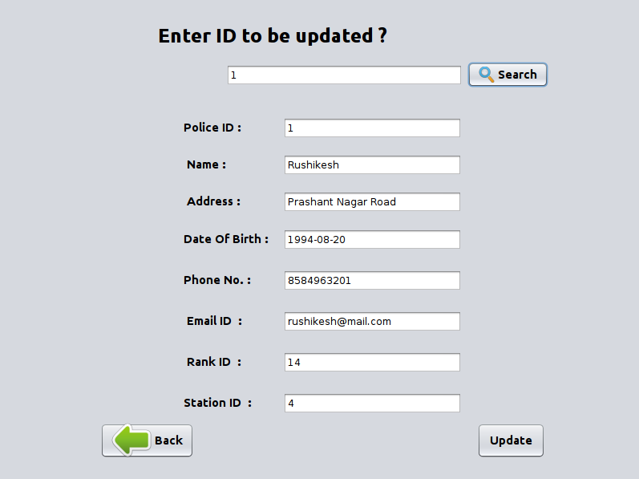
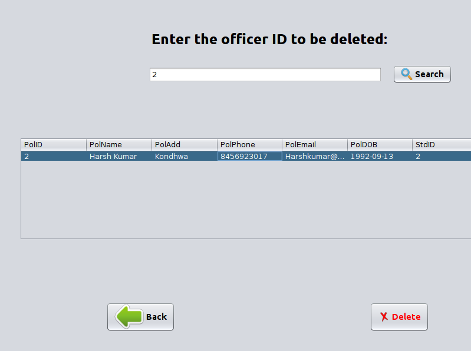
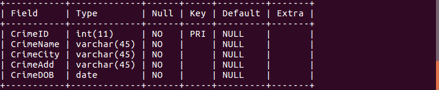

# PoliceDBMS-Project
**Police Database Management System Project**

This project is made as a Mini Project for DBMS subject.
In this project, We have 6 entities that are as follows:
1) Officer
2) Station
3) Rank
4) Criminal
5) Fine
6) Finetype

By using this management system, you can insert, update, delete, display and search the records in database faster and thus reducing the paperwork.

**Languages used :**
1. Java
2. MySQL

Below are some the screenshots of the system:

**Main Menu** 

**Officer Entity Menu**

**Insert Details Page**

**Search Page**

**Display Page**

**Update Page**

**Delete Page**

**Database**

1) Officer

2) Station

3) Rank

4) Criminal

5) Fine

6) Finetype

